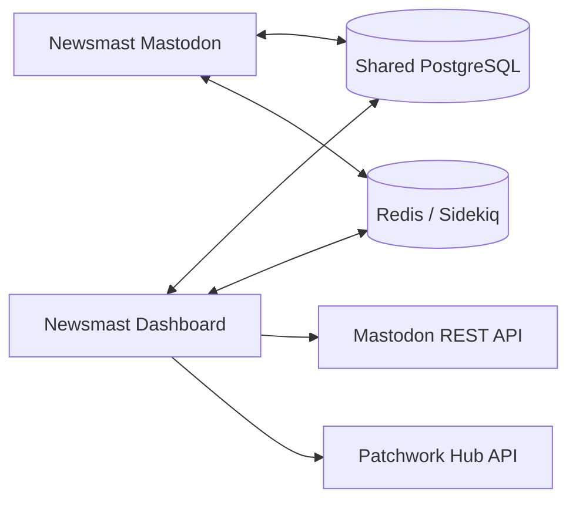

# Newsmast Dashboard and Mastodon integration

Newsmast Dashboard is a separate Rails application that cooperates with host Mastodon and Newsmast Mastodon. It is not a direct gem dependency.

| Area | Owner | Mechanism |
| --- | --- | --- |
| Channels, administrators, collections, filter/settings data | Dashboard | shared database |
| Custom feeds, extended filtering, supported reblog behavior | Newsmast Mastodon | shared database / Redis/Sidekiq |
| Account, status, and relationship operations | Dashboard and host Mastodon | Mastodon REST API / OAuth |
| Hub setting and filter synchronization | Dashboard and Patchwork Hub | Patchwork Hub API |
| Bridging, DNS, relays, object storage | Dashboard and external providers | external service |

Provision Mastodon, PostgreSQL, and Redis first; configure and migrate the Dashboard next; then install/update the compatible Newsmast Mastodon code using its own release guidance. Each repository owns its migrations and runtime configuration. See the canonical [technical architecture reference](https://github.com/TheNewsmastFoundation/newsmast-dashboard/blob/main/docs/architecture/mastodon-integration.md) and the related Newsmast Mastodon feature pages for implementation-specific behavior.